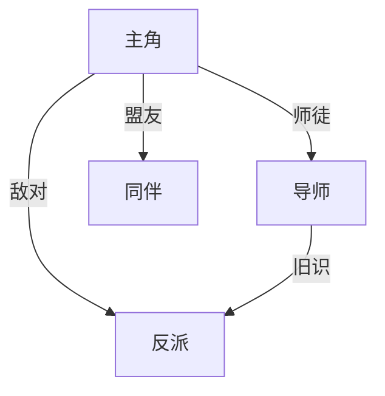

# 大纲设计方法论

> 来源：inkos Planner 14条原则 + fiction-crafter + tomato-novelist + story-writer + openclaw
> 使用方：Planner (Phase A 卷级大纲 + Phase B 逐章 Memo)

---

## 〇、卷理解示例（Step A1 产出）

加载 Advisor 的 Foundation + Genre Profile 后，在分解章节前先写一段卷理解：

```
### 卷1理解

本卷的核心命题："被封印的废材能否在无人知晓的情况下暗中恢复实力？
    恢复之后，他还是那个甘于隐藏的人吗？"

从卷首到卷末的情绪弧线：
  压抑窒息 → 苦修的隐忍 → 封印碎裂的爆发释放 → 立刻被兽潮威胁拉回紧张

本卷在全书三幕中的位置：
  第一幕（Setup，25%）— 建立世界+引入冲突+主角开始行动
```

## 一、情节单元设计14原则

1. **3-5章一个小目标周期**：每个情节单元形成一个"问题→尝试→挫折→突破"闭环
2. **主动塑造读者期待**：每个情节单元的末章必须让读者产生明确的"下一单元会发生什么"的期待
3. **万物皆饵**：日常/过渡描写中的每个细节都是未来的伏笔——在"关键情节"列标注哪些日常细节将在后续章回收
4. **人设防崩**：主角每个决策 = 过往经历 + 当前利益 + 性格特征。在情节单元的任务描述中验证
5. **1主线+1支线**：每个情节单元推进主线的同时，至少安排一个支线进展（角色关系/世界观细节/暗线）
6. **爽点密集化**：非过渡情节单元至少要有1个"读者会感到满足"的瞬间
7. **高潮前3-5章埋新伏笔**：卷末高潮前的情节单元必须埋设新伏笔
8. **高潮后1-2章写改变**：卷末高潮后必须有后效章——不能打完Boss立刻下一卷
9. **钩子承接**：每个情节单元的末章章尾钩子 → 下一单元首章承接
10. **钩子账本必须结账**：resolve N → open ≥ N，推荐比 1:2
11. **圆心法同场多视角**：重大事件后，用1章展示不同角色对同一事件的反应
12. **揭1埋2**：每回收一条伏笔，至少种下两条新伏笔
13. **人物立体化**：每3-5章至少有一个配角展示反差细节
14. **五感具体化**：每个情节单元至少标注1个"感官锚点场景"——让 Writer 知道这章要在哪个感官上着力

---

## 二、节奏分布计算

**章节类型分布**（按 Genre Profile chapterTypeDistribution）：

- 爆发章（25-30%）：标注在哪些情节单元充当高潮
- 蓄压章（35-40%）：标注每个蓄压章的目标事件（为第N章突破做准备 / 为卷末高潮埋伏笔）
- 后效章（15-20%）：标注对应哪个高潮事件
- 过渡章（10-15%）：标注承担的日常/支线功能

**填写示例**（卷总章数=20）：
```
本卷总章数：20

爆发章（25-30%）：约 5-6 章
  → 充当高潮：第3章(第一碎片) / 第10章(沈清霜初登场) / 第20章(法器认主) / 第28章(苏念卿) / 第40章(伪装) / 第72-73章(突破+核心后手)

蓄压章（35-40%）：约 7-8 章
  → 目标事件：[蓄压A→为第10章沈清霜出场准备] / [蓄压B→为卷末高潮埋伏笔]

后效章（15-20%）：约 3-4 章
  → 对应高潮：[后效A→第3章碎片] / [后效B→卷末高潮]

过渡章（10-15%）：约 2-3 章
  → 功能：[过渡A=展示坊市生活质感+引入兽潮线索] / [过渡B=深化主角与导师关系]
```

**节奏校验清单**：
- □ 连续蓄压不超过3章（否则 Auditor 标记 PacingMonotony WARNING）
- □ 每3-5章有一个中爽点（小目标周期闭环）
- □ 每8-12章有一个大爽点（境界突破/重大打脸）
- □ 卷末前2-3章开始爬升紧张度
- □ 卷末高潮后有后效章冷却（≥1章）
- □ 无连续2章同类型
- □ 爽点类型轮换检查：连续3章的爽点类型不重复

---

## 三、情绪曲线设计

**情绪刻度（1-10）**：
- 1-2 = 压抑/日常/蓄力
- 3-4 = 线索展开/冲突萌芽/小进展
- 5-6 = 小爽点/正面进展/关系突破
- 7-8 = 中爽点/境界突破/重大打脸
- 9-10 = 卷末高潮/核心伏笔回收

**情绪曲线模板**（填写示例——卷总章数=20）：

```
章号  1   2   3   4   5   6   7   8   9   10  11  12  13  14  15  16  17  18  19  20
情绪  2   3   6   4   5   3   3   4   4   5   3   4   3   3   5   3   3   8   5   3
      │   │   │   │   │   │   │   │   │   │   │   │   │   │   │   │   │   │   │   │
      日常 线索 第一 后效 沐灵 炼剑 日常 日常 蓄压 沈清 后效 兄弟 过渡 灵草 副脉 蓄压 蓄压 高潮 后效 钩子
      开场 发现 碎片 冷却 儿接 副脉    小爽  展示 霜第 冷却 互动   发现 激活             冷却
                        触             一次
                                       出场
```

**曲线校验**：
- □ 情绪曲线有起伏（连续3章情绪值不变→节奏单调）
- □ 卷首情绪 ≤ 4（不能以高潮开卷——除非全书第一章）
- □ 卷末情绪 ≥ 6（卷末必须有满足感）
- □ 卷末章尾情绪回落2-3点（高潮后的冷却+下一卷的悬念钩子）

**3章情绪循环**：每3章完成一次"压-小扬-压-爆"循环，爆点规模逐轮扩大。根据 Advisor 选定的情绪标签选择对应节奏模板（打脸爽文/极致虐恋/悬疑惊悚/脑洞大开——各有不同的3章循环写法）。

**评论区诱导节点**：在卷级大纲中预埋≥3种诱导节点（两难选择/信息差/误解不解释/配角高光/规则争议）。预埋后在对应章的 ChapterMemo 扣留段标注。

---

## 四、伏笔预算与钩子轮换

**伏笔预算规则**：
- 活跃伏笔 ≤ 12条
- 每章新埋 ≤ 2条
- 本卷回收 ≥ 本卷活跃伏笔数 × 30%
- 核心伏笔（core_hook=true）每条都有明确的推进节点
- 逾期伏笔（超过 expected_payoff 的）本卷必须推进或正式 defer
- resolve : open ≥ 1:1，推荐 1:2

**钩子轮换规则**：
- 每章章末钩子类型分配，避免连续3章同类型
- 钩子强度梯度（5级）：过渡章≤2，爆发前章≥3，卷末≥4
- 钩子禁忌：虚假悬念 / 机械降神 / 过度留白 / 低风险钩子

**伏笔推进计划表格式**：

| 伏笔ID | 类型 | core | 本卷目标 | 推进章 | 操作序列 | 预期卷末状态 |
|--------|------|------|---------|--------|---------|------------|
| H001 | world_truth | true | 回收 | N8, N18 | N8半揭示→N18彻底回收 | resolved |

---

## 五、时间线交叉验证

在卷级大纲产出后执行：

- □ 所有事件存在具体的时间锚点（"三天后"/"次日"/"一个月前"——不是模糊的"后来"）
- □ 同一角色不可能同时出现在两个地点（除非写明了移动过程）
- □ 修炼进度与时间流速一致（"三个月后"境界原地踏步→要么有解释要么是BUG）
- □ 伏笔的 plant 和 resolve 之间有合理时间间隔（不能第5章埋"神秘黑衣人"第6章就揭示——除非设计好的快速回收）
- □ 境界突破之间的时间间隔满足适应期要求（Genre Profile powerSystem）

---

## 六、三幕结构检查

**第一幕 Setup（全书前25%章）**：
- □ 主角的日常世界被打破了吗？
- □ 核心冲突的种子种下了吗？
- □ 读者的核心期待建立了吗？

**第二幕 Confrontation（全书25%-75%章）**：
- □ 冲突是否逐级升级（不是平级重复）？
- □ 中点是否有一个"游戏规则改变"的事件？
- □ "最黑暗的时刻"是否在第二幕末出现？

**第三幕 Resolution（全书75%-100%章）**：
- □ 所有核心伏笔是否在收束中？
- □ 节奏是否在加速（紧张度爬升）？
- □ 终局是否在望（读者能看到终点线）？

---

## 七、ContextPackage 6条硬规则

来源：inkos Governed Context + onkos 事实分级。

**规则1 — POV 过滤**：只包含当前 POV 角色能感知的信息。POV=主角 → 不包含反派密谋内容（除非主角通过某种方式获知）。

**规则2 — 时间窗口（3章窗口）**：N-1章完整包含 / N-2章摘要包含 / N-3章仅关键信息 / N-4章及更早仅在直接引用时包含。

**规则3 — 伏笔临近度**：expected_payoff 在 N±2章→完整包含；5章之外→仅一句话提醒；status=planted 且 20 章未推进→不包含。

**规则4 — 人物相关度**：Memo 中出现的角色→包含当前状态+语言指纹。未出现的角色→不包含。隐藏观察者→包含但标记"本章不出现，仅供气氛参考"。

**规则5 — 世界设定范围**：本章场景所在区域→完整包含。不涉及的势力/区域→不包含。

**规则6 — 事实重要性分级**（来源：onkos）：permanent（永久）→ 始终包含；arc_scoped（弧级）→ 当前卷内有效；chapter_scoped（章级）→ 仅最近3章有效。

---

## 八、追读力评分

来源：rhythm-report-template.md。

**追读力公式**：
```
reader_pull = engagement × 0.40 + hook_strength × 0.35 + tension_level × 0.25
```
- engagement（投入度）：读者对当前情节的情感投入程度
- hook_strength（钩力）：章末钩子让读者翻下一章的冲动强度
- tension_level（紧张度）：当前冲突的紧迫程度

**节奏检测规则**：
- 连续3章追读力下降 → 节奏问题警告
- 爆发章后追读力骤降>30% → 后效章冷却过度
- 过渡章追读力过低 → 日常描写缺乏悬念锚点

**趋势分析**：每5章计算平均追读力，对比前5章趋势→上升/持平/下降。下降趋势持续10章以上→建议 Planner 调整节奏分布。

---

## 九、叙事债务报告

来源：rhythm-report-template.md。

**债务公式**：
```
total_debt = Σ(open_hooks × urgency) + Σ(unresolved_conflicts × chapters_since_intro)
```

**债务等级**：
- 轻债（total_debt < 20）：正常——叙事健康
- 中债（20-40）：注意——建议近期回收部分伏笔或解决次要冲突
- 重债（>40）：警告——读者可能感到"什么都在悬着，什么都没解决"

**输出格式**（每5章或每卷末）：
```
📊 叙事债务报告 — 第N章
债务等级：轻债/中债/重债
活跃伏笔：X条（其中逾期Y条）
未解决冲突：Z个
建议：...
```

---

## 十、结构图生成（Mermaid）

来源：diagram-guide.md。生成可视化故事结构图供人类审阅。

### 何时生成图表

| 触发时机 | 图表类型 |
|---------|---------|
| Advisor 方案定稿后 | 势力分布图 + 等级/力量体系图 |
| 每卷大纲产出后 | 剧情时间线图 + 伏笔回收状态图 |
| 每5章节奏报告时 | 人物关系图 + 因果链图 |

### 六种图表类型

**人物关系图**：


**势力分布图**：用不同颜色标注势力范围和影响力等级。

**等级/力量体系图**：按境界从低到高排列，标注跨境条件和关键节点。

**剧情时间线图**：横轴=章号，标注关键事件、伏笔埋设/回收点、角色登场/退场。

**伏笔回收状态图**：活跃伏笔按 urgency 排序，颜色标注状态（已逾期/即将逾期/正常）。

**因果链图**：展示前台事件和后台暗线的因果关系。

### 图例规范
- 实线=已确认关系，虚线=暗示/推测
- 红色=冲突/敌对，绿色=同盟/友好，蓝色=伏笔/暗线
- 节点大小=重要性权重

---

## 十一、ChapterMemo 模板补充

### 三问测试

来源：chapter_memo_template.md。生成 ChapterMemo 时必须回答：

1. 如果跳过本章，读者会错过什么？
   → 本章对整体叙事不可替代的价值——不是"错过一些日常"，而是"错过X线索/错过Y关系转折/错过Z伏笔种子"

2. 本章的爽点/看点是什么？
   → 如果本章无明确爽点（过渡章/蓄压章前期），写"本章的看点是___（世界质感/角色互动/氛围/信息量）"——不能留空

3. 本章推进了哪条主线/支线？
   → KR编号 + 具体的推进体现在哪里 + 本章结束时的状态vs开始时的状态

### 日常/过渡功能

来源：chapter_memo_template.md。非高压章填写，高压章写"不适用——本章全程高压"。

每段非冲突内容承担什么功能：世界观展示 / 人物关系深化 / 为后续伏笔铺路 / 展示时间流逝 / 感官沉浸

### 章节结构百分比

来源：chapter-template-tomato.md。每章2200-2800字的参考结构：

| 结构段 | 比例 | 字数 | 功能 |
|--------|------|------|------|
| 开头 | 20% | ~450-550 | 承接前章钩子，建立本章目标 |
| 发展 | 50-60% | ~1100-1500 | 核心情节推进，爽点/冲突展开 |
| 高潮 | 15-20% | ~350-500 | 本章情绪峰值，关键转折 |
| 结尾 | 5-10% | ~150-250 | 章末钩子，余韵 |

### 创作进度看板

来源：outline-template-tomato.md。Planner 可选产出，供人类追踪。

| 章 | 标题 | 类型 | 核心爆点 | 钩子类型 | 状态 | 字数 | 催更点 |
|----|------|------|---------|---------|------|------|--------|
| 1 | — | 蓄压 | — | 悬念 | planned | — | — |
