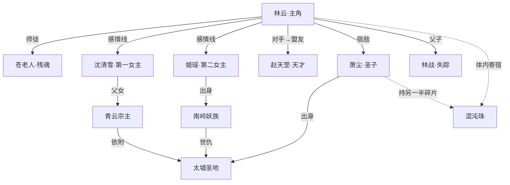

# 《未命名》创作提示词

> 方向：废材逆袭流玄幻 / 双女主 / 群像叙事
> 生成日期：2026-05-02
> 状态：待确认（第一轮修订）

---

## 1. 题材定位

| 维度 | 内容 |
|------|------|
| 主类型 | 东方玄幻 |
| 子类型 | 废材逆袭 / 修炼升级流 |
| 人物策略 | **群像叙事**——主角 50%，双女主+核心配角各占独立戏份和成长线 |
| 感情线 | **双女主**——事业线与感情线并行，两条感情线气质迥异、各有张力 |
| 风格基调 | 热血 + 权谋 + 情感，拒绝纯打脸循环——主角会赢，但也会输 |
| 目标篇幅 | ~750 章，每章 2200-2500 字（东荒 ~240 章 / 中州 ~220 章 / 天道 ~170 章 / 超脱 ~120 章） |

**参考作品气质**：《斗破苍穹》的废材崛起线 ×《凡人修仙传》的谨慎与代价 ×《雪中悍刀行》的群像人物厚度

---

## 2. 世界观设定

### 力量体系

```
┌────────────────────────────────────────────────────────────┐
│  境界层级                    区域上限                       │
│                                                           │
│  凡人三境（基础）：                                        │
│    炼体（1-9重）→ 开元（1-9重）→ 凝魂（1-9重）             │
│                                                           │
│  修士六境（登天）：                                        │
│    灵海（1-9重）→ 神府（1-9重）→ 天象（1-9重）             │
│    → 道台（1-9重）→ 圣王（1-9重）→ 帝境（1-9重）           │
│                                                           │
│  终极：                                                    │
│    帝境之上，传说有「超脱」——万年无人达到。天道有缺，帝路已断。│
│                                                           │
│  共 9 境（3 凡人 + 6 修士），每境 1-9 重                   │
└────────────────────────────────────────────────────────────┘

区域境界天花板（灵气浓度决定上限）：

  东荒 ──→ 最高 7 境（天象），当前东荒最强者为天象境
  中州 ──→ 最高 8 境（圣王），四大圣地有圣王坐镇
  全域 ──→ 9 境（帝境）万年无人，天道封锁中
```

**核心设定**：灵气浓度决定修炼上限。东荒灵气稀薄，天象境已是天花板——这意味着林云在东荒修炼到 5-6 境（神府→天象）时，已经接近东荒的极限，必须进入中州才能继续突破。这也解释了为什么东荒被看不起：不是人不行，是天地不给机会。

### 大陆格局

| 区域 | 灵气浓度 | 最高境界 | 特征 |
|------|----------|----------|------|
| 东荒 | 稀薄 | 天象（7境） | 主角出生地，宗门弱小，被视为"蛮夷之地"。灵气虽薄，但上古遗迹众多——曾是古战场 |
| 中州 | 浓郁 | 圣王（8境） | 大陆中心，四大圣地所在。万族林立，强者如云 |
| 西漠 | 中 | 道台（7境） | 佛门势力，苦行僧与密宗并存，隐藏上古遗迹 |
| 南岭 | 中 | 道台（7境） | 妖族领地，十万大山，妖兽横行 |
| 北冥 | 稀薄 | 未知 | 极寒之地，帝境大战的古战场，隐藏帝境之秘 |

### 社会结构

- **宗门**：主流势力形态，分九品到一品，一品之上为"圣地"
- **世家**：血脉传承，拥有天赋神通，与宗门既合作又对抗
- **散修**：无门无派，靠机缘和拼命，社会底层
- **禁地**：上古战场 / 帝墓 / 秘境，高风险高回报
- **王朝**：凡人国度，名义上统治东荒，实则依附于宗门

### 核心规则

1. **灵气并非均匀分布** → 地域歧视和资源争夺的根本原因
2. **血脉可觉醒但不决定一切** → 废材有翻盘可能
3. **功法分天地玄黄四阶** → 高阶功法的获取本身就是一场冒险
4. **修炼有瓶颈，突破需机缘** → 不是堆资源就必然升级
5. **帝境强者万年不出** →"天道有缺"是整个世界的终极悬念
6. **无背景者寸步难行** → 没有靠山的人，突破太快反而引来杀身之祸

---

## 3. 主角人设

### 基本信息

| 维度 | 设定 |
|------|------|
| 姓名 | 林云（暂定，可改） |
| 初始年龄 | 16 岁 |
| 初始身份 | 东荒青云宗外门弟子，三年炼体三重——宗门"著名废材" |
| 性格 | 隐忍但不窝囊，精明但不阴险；表面沉默寡言，内心算计深远；对敌人不留情，对自己人倾尽一切 |
| 金手指 | **混沌珠**——上古神物碎片，寄宿于体内 |

### 性格深度

- **核心驱动**：不只是"变强"——他想知道父亲失踪的真相。变强是手段，不是目的
- **致命缺陷**：过度隐忍有时变成"憋屈"——明明可以反击却因顾虑太多而错失时机，需要成长中克服
- **道德灰度**：不是圣母，也不黑化。会报复，但不过度；会算计，但不背叛自己人

### 金手指：混沌珠

| 维度 | 设定 |
|------|------|
| 能力 | ① 吞噬并解析万物本源（功法 / 丹药 / 血脉 / 阵法），推演出完美版本 ② 内含独立空间，时间流速可调（初期×2，随宿主变强增长） ③ 偶尔释放上古记忆碎片（剧情线索） |
| 限制 | ① 每次使用消耗魂力，过度使用会陷入沉睡 ② 无法解析超出宿主当前境界两个大阶的物体 ③ 空间内时间加速有冷却期（初期 7 天用 1 次） ④ 混沌珠本身不提供战斗力——解析出来的东西还得靠自己练 ⑤ **混沌珠的气息会吸引某些上古存在的注意**——这是最大的隐藏代价 |
| 成长性 | 混沌珠随宿主变强逐步解锁新能力，不是一次性给满 |

### 逆袭起点（废材原因）

- **表面原因**：灵脉堵塞，修炼速度只有常人的十分之一
- **真正原因**：混沌珠寄生于灵脉中，吸收了 90% 的修炼灵气（金手指最初是负担）
- **觉醒契机**：宗门大比上被公开羞辱 → 濒死之际混沌珠激活 → 灵脉重塑

### 成长路径中的真正挫折（关键）

主角不是一路赢到底——以下挫折必须至少发生 3-4 次：

| 挫折类型 | 示例 |
|----------|------|
| **权力碾压** | 崭露头角后被宗门长老忌惮，以"勾结外敌"为由重伤并逐出师门 |
| **被设计陷害** | 信任的人（非核心圈）在关键时刻背叛，导致秘境中几乎全军覆没 |
| **金手指失效** | 混沌珠被某种力量暂时封印，主角被迫在完全"废材"状态下求生 |
| **失去重要之人** | 某个重要配角因主角的决策失误而死（或疑似死亡） |
| **立场困境** | 正义和利益冲突，选择正义但付出惨痛代价 |

---

## 4. 双女主设定

### 女主一：沈清雪

| 维度 | 设定 |
|------|------|
| 定位 | **第一女主**——冰冷外表下的温柔，与主角从对立到相知 |
| 初始身份 | 青云宗宗主之女，内门天才，灵海境 |
| 性格 | 表面冷若冰霜、拒人千里；实则内心柔软、极度重情。不善表达，用行动而非言语 |
| 与主角关系线 | 最初是"天与地"的差距——她甚至不知道外门有林云这个人 → 第一次注意到他是擂台上他被羞辱时的眼神（不屈） → 兽潮中看到他出手救人，开始好奇 → 在她被家族逼婚/政治联姻时，林云是唯一敢于站出来反对的人 → 感情在最不可能的时刻萌芽 |
| 独立成长线 | **不是男主的附属品**——她有自己的修炼之路：从被父亲当作联姻工具 → 挣脱家族枷锁 → 建立自己的势力 → 成为东荒第一个女性圣王 |
| 核心矛盾 | 家族责任 vs 自我意志；对林云的感情 vs 父亲的反对 |

### 女主二：姬瑶

| 维度 | 设定 |
|------|------|
| 定位 | **第二女主**——火辣直接的妖女型，与沈清雪形成鲜明对比 |
| 初始身份 | 南岭妖族公主（隐藏身份），化名混入人类世界 |
| 性格 | 大胆、直率、从不遮掩自己的想法；爱憎分明，可以为一个人毁掉一座城；嘴硬心软，嘴上说"本王才不在乎"转头就去拼命 |
| 与主角关系线 | 第一次相遇是敌对——她在执行妖族秘密任务时被林云撞破 → 两人大打出手 → 不打不相识 → 被迫合作 → 在生死关头互救 → 情感在冲突中升温 → 但当她的妖族身份暴露时，林云面临"人妖两族对立"的立场抉择 |
| 独立成长线 | 从被妖族长老会视为"不懂事的公主" → 在人族世界的历练中觉醒妖族皇血 → 回到南岭夺回权力 → 成为妖族真正的王 |
| 核心矛盾 | 对林云的感情 vs 妖族利益；妖族传统 vs 人妖共存理念 |

### 双女主之间的矛盾线（重点）

沈清雪和姬瑶不是简单的情敌——她们之间的矛盾是多维的：

**矛盾一：出身与立场**
- 沈清雪是人族宗门之女，姬瑶是妖族公主——两族千年世仇
- 她们对"正义"的定义完全不同：沈清雪认同秩序与规则，姬瑶信奉力量与自由
- 当人妖两族冲突升级时，她们各自代表的一方天然对立

**矛盾二：性格与行事风格**
- 沈清雪：克制、隐忍、权衡利弊——"大局为重"
- 姬瑶：直接、冲动、率性而为——"想做就做"
- 面对同一个危机：沈清雪要冷静谋划，姬瑶要正面硬刚 → 冲突不可避免

**矛盾三：对林云的方式**
- 沈清雪：希望林云走"正道"，堂堂正正崛起，不愿他陷入危险
- 姬瑶：认为"只要能赢，手段不重要"，鼓励林云走捷径
- 两人对"什么是对林云好"有根本分歧

**矛盾四：身份暴露后的裂痕**
- 姬瑶妖族身份暴露 → 沈清雪作为人族宗门核心，必须表态
- "相爱却不能相认"的境地——不止是林云和女主之间，也是**两个女人之间**：她们其实已经在并肩作战中有了默契和欣赏，但立场迫使她们站到对立面

### 修罗场戏份设计（情绪张力核心）

修罗场不是争风吃醋——是**相爱之人在错误的时间相遇**：

| 场景 | 情境 | 情绪张力 |
|------|------|----------|
| **三方对峙** | 姬瑶身份暴露后，沈清雪以宗门立场质问林云"你早就知道她是妖？"——林云默认。沈清雪转身离开。姬瑶冷笑："你们人族，也不过如此。" | 沈清雪的背叛感 vs 姬瑶的失望 vs 林云的两难 |
| **立场倒转** | 沈清雪被家族逼婚，林云杀入婚礼现场抢人——但帮他的人偏偏是姬瑶。沈清雪看着两人并肩作战的身影，第一次感到"自己也许是外人" | 嫉妒 + 感激 + 自我怀疑杂糅 |
| **被迫对立** | 人妖谈判桌上，沈清雪代表人族，姬瑶代表妖族，林云坐在中间。两人都看着他，等他选择——他选了第三条路（两族共存），但这条路在当时被视为"背叛" | 政治立场 + 私人情感的双重撕裂 |
| **生死之间的和解** | 某次危机中，沈清雪和姬瑶被困在一起，必须合作才能生还。两天一夜，从互相戒备到坦诚对话，到发现"如果换个世界，我们本来可以是朋友" | 悲壮的和解——我们不是敌人，是命运逼我们成了敌人 |

### 修罗场写作原则

1. **不靠误会推动**——不是"她以为他和她有什么"的狗血误会。每个角色的选择都有充分的自身逻辑
2. **情绪 > 台词**——修罗场不只靠对话，更要靠"沉默""转身""眼神""停顿"来传递
3. **事后有回响**——修罗场不是一次性的，每次修罗场之后角色关系都要发生真实变化
4. **最终要圆回来**——无论中间多虐，结局要有合理的情感收束（不一定是大团圆，但要有闭合弧线）

### 感情线节奏（修订）

```
第一卷：
  沈清雪线——萌芽期。她第一次注意到"外门那条最瘦的狗"眼里有火。
  姬瑶线——以"神秘对手"身份短暂交锋，留下悬念。
  双女主之间——还未相遇。

第二卷：
  沈清雪线——升温期。禁忌之恋面对家族压力，她的每一个靠近都在付出代价。
  姬瑶线——从敌人→被迫合作→暧昧初生，但他的身世立场始终是刺。
  双女主相遇——初次见面火药味十足，但首次联手战斗中萌发互相欣赏。
  首次修罗场——姬瑶身份暴露，沈清雪立场与情感撕裂。

第三卷：
  两段感情线同时进入深水区。
  沈清雪：与家族决裂，但也无法完全接受林云与妖族的亲近。
  姬瑶：妖族利益与个人情感的极限拉扯。
  双女主之间：被迫对立后的冷战→某次联手后的和解→再次被更大的局势撕开。
  核心修罗场：人妖谈判桌上的三方对峙——"我们不是敌人，是命运逼我们成了敌人。"

第四卷：
  感情线与主线共同收束。
  两条感情线的最终走向：不一定是传统后宫/二选一——
  可能是各自在自己的道路上走向成熟，情感超越了"在一起"的单一结局。
```

---

## 5. 群像角色矩阵

### 群像策略

**不强制独立章节**——配角不需要专门的 POV 章节。群像感通过以下方式自然融入：

- **环境铺垫中夹带**：在场景切换时，用一两句话交代配角的动态（"与此同时，赵天罡正在后山对着石壁疯狂挥剑——他今天输得太难看了。"）
- **对话中侧面塑造**：通过其他角色的台词反映配角的行动和变化，而非直接展开配角视角
- **关键节点展开**：仅在配角做出重大决策或命运转折时，才给予较完整的独立视角段落
- **留白**：不是每个配角都要写满——有些角色的"沉默"和"不在场"本身就是叙事手段

### 核心配角

| 角色 | 定位 | 塑造方式 | 弧光 |
|------|------|----------|------|
| **苍老人** | 导师——混沌珠残魂 | 主要通过对话塑造，偶尔给予独立瞬间 | 从"利用林云复活自己"到"真心传承衣钵" |
| **赵天罡** | 前期对手→中期盟友 | 环境铺垫+关键节点展开（如他败后独自练剑的片段） | 从目中无人的天才→自我怀疑→找到自己的道 |
| **萧尘** | 核心宿敌 | 关键节点展开独立视角 | 不是单纯的坏人——他也有守护之人，持有混沌珠另一半碎片 |
| **林战** | 父亲（失踪） | 回忆线+环境线索+后期回归 | 他的失踪是全书最大伏笔之一 |

### 配角必须遵守的原则

- 每个配角的行动由**自身动机**驱动，而非"为主角服务"
- 配角的成长不影响主角的地位，但影响剧情的走向
- **配角会死**——群像的意义在于"失去"才有重量，离别才有力量

### 势力关系图



---

## 6. 核心冲突

### 主线矛盾

```
个人层面：废材 → 崛起，但每一次上升都付出真实代价
         （不是"升级打怪换地图"——每次突破都伴随失去）

势力层面：东荒小宗 → 中州圣地 → 大陆格局重整
         （卷入的势力越来越大，敌人越来越强）

感情层面：两段感情都面临立场冲突——沈清雪（宗门之女 vs 被逐弟子）
         姬瑶（人族 vs 妖族）

世界层面：天道有缺 → 帝路断绝 → 混沌珠是打破禁制的钥匙
         → 但打破禁制的代价可能是"旧世界的毁灭"
```

### 前 3 章即时冲突（修订）

| 章节 | 核心冲突 | 节奏模式 |
|------|----------|----------|
| 第 1 章 | 宗门大比——林云被安排给内门天才赵天罡当"陪练沙包"。但这次不是一招败北：林云明知不敌，仍然撑了三招，每一招都在拼命。第三招时他被打飞，但他爬起来的速度比前两次更快——赵天罡的瞳孔微缩。战后，长老宣布剥夺外门资格。但赵天罡临走前回头看了林云一眼。 | 憋屈蓄力 |
| 第 2 章 | 被逐后在荒野遇险濒死，混沌珠觉醒，灵脉重塑。同时——宗门深处，某位太上长老骤睁双眼：这道气息…回来了。但林云不知道的是，这位太上长老，正是当年针对他父亲的人。 | 悬念模式 |
| 第 3 章 | 林云返回宗门附近时遇兽潮围攻外门弟子，他出手救人——展现远超"废材"的实力。战斗过程艰难但漂亮，围观者震惊。然而战后，那位太上长老没有嘉奖，而是用冰冷的目光审视他，对身边人低声说："查他的底。" | 爽文模式→悬念收尾 |

---

## 7. 节奏架构（第二轮重写）

### 核心原则

> 节奏不能是机械的公式。每一个爽点和挫折之间必须有**因果关系**——是上一个事件自然引出了下一个，而非"该打脸了所以安排打脸""该挫折了所以安排挫折"。

### 因果链节奏模型

```
┌──────────────────────────────────────────────────────────────┐
│                    因果链驱动节奏                              │
│                                                              │
│  打脸/爽点 ──→ 引起注意 ──→ 引出新人物/新势力                  │
│     ↓                                                        │
│  新人物/势力介入 ──→ 产生新的矛盾                              │
│     ↓                                                        │
│  新的矛盾 ──→ 对手太强/背景太深 ──→ 自然进入挫折               │
│     ↓                                                        │
│  挫折中 ──→ 主角靠之前的积累+计谋+意志力 ──→ 反弹              │
│     ↓                                                        │
│  反弹胜利 ──→ 但胜利暴露了主角的存在 ──→ 引起更大的注意         │
│     ↓                                                        │
│  （循环，但每一次循环的规模和代价都在升级）                     │
└──────────────────────────────────────────────────────────────┘
```

### 节奏多变原则

**不是单一的打脸→挫折→反弹循环**，而是根据情节需要切换节奏模式：

| 节奏模式 | 何时使用 | 情绪效果 |
|----------|----------|----------|
| **爽文模式** | 铺垫已到位，读者期待主角展现实力 | 痛快、释放 |
| **拉扯模式** | 势均力敌的对决或情感博弈 | 紧张、揪心 |
| **憋屈蓄力模式** | 对手过强，主角暂时被压制，暗中积蓄力量 | 压抑但期待 |
| **爆发模式** | 压抑到了临界点，主角绝地反击 | 酣畅淋漓 |
| **缓冲模式** | 大高潮后，角色关系推进、日常、修炼 | 松弛、会心一笑 |
| **悬念模式** | 揭示新信息、埋下新伏笔、转折预告 | 好奇、不安 |

**一卷之内必须包含以上多种模式，不能连续 10 章只有一种节奏。**

### 大爽点（打脸/战斗）写作规范

**铺垫四要素**（打脸之前必须完成）：

```
1. 对手之强：用具体事件展示，而非旁白叙述。
   错误写法："赵天罡很强。"
   正确写法："赵天罡上台时，观战席第一排的长老们不约而同地直起了腰。"

2. 差距之悬：让读者清楚知道林云和对手的差距有多大。
   错误写法："这一战很难。"
   正确写法："林云看着赵天罡周身涌动的灵海威压，盘算了一下——
           自己的胜率不到一成。但他还是走上了擂台。"

3. 过程中的领悟/意志力：
   战斗不是碾压——林云必须在这场战斗中有所领悟（功法上的豁然开朗、
   自身缺陷的发现、意志力的极限突破）。跨境而战，胜在"别人放弃了他没有"。

4. 代价必须真实：
   跨境战胜强敌，不能毫发无伤。
   林云赢了——但断了几根肋骨，修养数章才能恢复。
   如果代价太轻，读者会觉得"假"。
```

**打脸的情绪张力公式**：

```
被看不起（读者共情） → 差距展示（紧张感） → 战斗中的挣扎/逆境（揪心）
→ 临阵领悟/意志力突破（热血） → 逆转（释放） → 对手/旁观者反应（爽）
→ 代价显现（真实感） → 新隐患/新关注（下一轮悬念）
```

### 大挫折写作规范

挫折不是"为虐而虐"——**是因果链的必然**：

```
关键原则：
  × 错误：主角出门 → 遇到一个不认识的强者 → 被揍了一顿（这是作者在揍主角）
  ✓ 正确：主角的打脸引起了长老的忌惮（因果1）
          → 长老调查主角的背景（因果2）
          → 发现林云的父亲曾经得罪过自己（因果3）
          → 长老以"清理余孽"为名出手（因果4）
          → 林云被重伤囚禁（挫折）

  每一个挫折都是"之前的行为 + 他人的动机"自然推导出来的。
```

### 挫折-反弹因果链示例

| 阶段 | 前一环节 | 因果 | 挫折 | 反弹 |
|------|----------|------|------|------|
| 第 6-12 章 | 兽潮中林云越级战斗，引起关注 | 长老调查 → 发现其父林战曾得罪过此人 → | **长老以"修炼邪功"罪名重伤并囚禁** | 狱中参悟+混沌珠指引 → 意外被救 |
| 第 26-35 章 | 林云在散修中建立声望 | 声望引来注意 → 某天被旧日同伴嫉妒 → | **被信任的同伴出卖，秘境中被围攻，混沌珠暂时失效** | 靠体术和计谋反杀 → 强化了"不依赖金手指"的能力 |
| 第 45-55 章 | 林云势力雏形初具 | 势力发展触动地方豪强利益 → 豪强联手打压 → | **被围剿，核心成员离散，林云身负重伤** | 离散中各自成长 → 以少胜多重聚 → 势力涅槃 |

### 大小挫折交杂原则

- **小挫折**（1-2 章）：一次战斗失利、一条线索断了、一次争吵、一次被算计
  ——功能：保持紧张感，不让读者觉得"太顺"
- **大挫折**（3-5 章）：重伤/囚禁/被背叛/失去重要之人/势力被摧毁
  ——功能：推动角色蜕变，改变故事格局
- **交错频率**：每 1-2 个小挫折后有一段小反弹，每 2-3 轮"小挫折→小反弹"后迎来一次大挫折
- **不可连续大挫折**：两个大挫折之间至少间隔 15-20 章（否则读者扛不住）

### 情绪曲线原则

- **压抑上限 5 章**：超过 5 章没有正向反馈，读者会流失
- **爽后必有隐患**：每次大胜之后的 1-2 章内，必须暗示新的威胁
- **缓冲章必须存在**：大高潮后 1-2 章用于情感交流、日常互动、角色关系推进——这是读者"喘气"的时间
- **感情线和事业线交替**：不要连续 5 章纯战斗或连续 5 章纯情感
- **节奏突变**：在读者以为进入安全期的时候，突然加速（反之亦然）——可预测的节奏 = 无聊

---

## 8. 全局节奏（第四轮修订——东荒全拆分版）

### 核心原则

> 东荒是主角最重要的积累期。从炼体三重到天象门槛，每一步都要扎实。
> 区域天花板：东荒最高 7 境（天象），中州最高 8 境（圣王）。
> 每一个大阶段 → 拆 3-4 个子阶段，每个子阶段 → 拆 3-4 个情节单元。

### 林云境界成长全景

```
第一卷·东荒（第 1-240 章）：
  炼体三重 → 开元 → 凝魂 → 灵海 → 神府 → 天象门槛
  离开时：神府巅峰/天象初境，已接近东荒天花板（7境）

第二卷·中州（第 241-460 章）：
  天象 → 道台 → 圣王
  追上中州最高水平（8境）

第三卷·天道（第 461-630 章）：
  圣王 → 帝境
  打破万年禁制

第四卷·超脱（第 631-750 章）：
  帝境 → 超脱
```

---

### 第一卷「东荒·废材之名」（第 1-240 章）

> 四大阶段，每个阶段 3-4 子阶段，每个子阶段 3-5 个小情节单元。
> 240 章 = 约占全书 1/3，与东荒作为"根基之地"的地位匹配。

```
═══════════════════════════════════════════════════════════════
第一阶段：废材觉醒（第 1-40 章）
  境界：炼体三重 → 开元巅峰
  核心悬念：混沌珠是什么？谁在追查林云？

  ┌─ 子阶段 1.1：宗门之辱（第 1-8 章）─────────────────────┐
  │                                                         │
  │ 1.1.1 擂台沙包（1-3章）：宗门大比→被安排当赵天罡陪练→    │
  │       明知不敌仍撑三招→被打飞但每次爬起更快→赵天罡瞳孔微缩 │
  │       节奏：憋屈蓄力                                     │
  │                                                         │
  │ 1.1.2 被逐（4-5章）：长老宣判剥夺外门资格→台下哄笑→       │
  │       林云沉默离开→但走过沈清雪身边时，她看到了他的眼神     │
  │       节奏：压抑                                         │
  │                                                         │
  │ 1.1.3 荒野濒死（6-8章）：荒野中倒下→血染溪水→体内第一次    │
  │       异动→混沌珠脉动。同时，宗门深处太上长老睁眼。        │
  │       节奏：悬念爆发                                      │
  └─────────────────────────────────────────────────────────┘

  ┌─ 子阶段 1.2：初次展露（第 9-18 章）────────────────────┐
  │                                                         │
  │ 1.2.1 灵脉重塑（9-10章）：混沌珠觉醒→灵脉缓慢修复→        │
  │       第一次感受到灵气顺畅入体→三年来第一次真正修炼        │
  │       节奏：缓冲（读者需要喘气）                           │
  │                                                         │
  │ 1.2.2 兽潮（11-13章）：回宗门附近→遭遇兽潮围攻外门弟子→   │
  │       林云出手救人→展现远超废材的战力→围观者震惊→          │
  │       但战斗艰难，每次出手都有代价——他受了不轻的伤         │
  │       节奏：爽文（但带代价）                               │
  │                                                         │
  │ 1.2.3 冰冷审视（14-15章）：战后→太上长老没有嘉奖→          │
  │       用冰冷的目光审视他，低声说"查他的底"                  │
  │       沈清雪第一次主动接近林云——"你之前在隐藏实力？"       │
  │       节奏：悬念 + 感情萌芽                                │
  │                                                         │
  │ 1.2.4 暗中调查（16-18章）：太上长老的调查线→              │
  │       翻出林战旧案→与林云的关联浮出水面→决定出手           │
  │       林云开始尝试使用混沌珠解析低阶功法→发现金手指规则     │
  │       节奏：双线推进（反派准备 + 主角成长）                 │
  └─────────────────────────────────────────────────────────┘

  ┌─ 子阶段 1.3：囚禁之劫（第 19-30 章）───────────────────┐
  │                                                         │
  │ 1.3.1 诬陷（19-21章）：太上长老以"修炼邪功"罪名→          │
  │       当众擒拿→林云开元初境 vs 天象境→毫无还手之力→        │
  │       被当众重伤→围观者无人敢出声→赵天罡表情复杂           │
  │       节奏：憋屈蓄力至顶点                                │
  │                                                         │
  │ 1.3.2 狱中（22-24章）：阴暗地牢→苍老人残魂首次开口——      │
  │       "小子，你体内有我主人的东西。"→                     │
  │       "害你父亲的人，就在青云宗里。"→林云追问→沉默         │
  │       混沌珠在狱中缓慢修复林云的伤势→首次推演功法           │
  │       节奏：悬念 + 蓄力                                   │
  │                                                         │
  │ 1.3.3 越狱（25-28章）：意外之人相助（悬念：谁？）→         │
  │       深夜逃出→太上长老的人追捕→                         │
  │       林云开元中境 vs 宗门追兵→以弱胜强数次险死→           │
  │       逃出生天时已浑身是血→突破至开元巅峰                  │
  │       节奏：爆发                                          │
  │                                                         │
  │ 1.3.4 逃亡路上（29-30章）：离开青云宗范围→                │
  │       养伤+回顾：苍老人的话、太上长老的眼神、               │
  │       还有那个帮他越狱的神秘人（不揭晓，长期悬念）          │
  │       决定：化名进入散修世界，从零开始                     │
  │       节奏：缓冲 + 情感沉淀                                │
  └─────────────────────────────────────────────────────────┘

  ┌─ 子阶段 1.4：散修入门（第 31-40 章）───────────────────┐
  │                                                         │
  │ 1.4.1 新身份（31-32章）：化名"云尘"→进入东荒散修聚集地    │
  │       →被当作"不知哪来的野修"→第一次感受到散修世界的残酷   │
  │       节奏：缓冲（新地图展开）                             │
  │                                                         │
  │ 1.4.2 首次散修冲突（33-35章）：被老散修欺负→隐忍→          │
  │       对方得寸进尺→林云出手→碾压→围观散修震惊              │
  │       节奏：爽文（小规模打脸）                             │
  │                                                         │
  │ 1.4.3 姬瑶初遇（36-38章）：不打不相识→                   │
  │       化名"瑶姬"在任务中与林云撞上→两人大打出手→          │
  │       打了一半发现被人设计→暂时合作→脱险后各自离开         │
  │       "下次见面，我不会手下留情。""彼此彼此。"             │
  │       节奏：拉扯（对手→临时队友）                          │
  │                                                         │
  │ 1.4.4 站稳脚跟（39-40章）：第一次靠实力在散修中赢得尊重→   │
  │       沈清雪线暗线：她通过自己的渠道得知林云在散修中的消息→ │
  │       默默关注，没有打扰                                   │
  │       节奏：缓冲 + 感情暗线                                │
  └─────────────────────────────────────────────────────────┘
═══════════════════════════════════════════════════════════════

═══════════════════════════════════════════════════════════════
第二阶段：散修磨砺（第 41-100 章）
  境界：开元巅峰 → 凝魂巅峰
  核心悬念：东荒古战场的秘密？神秘背叛者是谁？

  ┌─ 子阶段 2.1：秘境争锋（第 41-52 章）───────────────────┐
  │                                                         │
  │ 2.1.1 秘境消息（41-42章）：东荒散修圈传出上古秘境消息→    │
  │       各方散修聚集→林云决定参加→认识第一批临时队友         │
  │       节奏：缓冲（组队 + 铺垫）                            │
  │                                                         │
  │ 2.1.2 入秘境（43-45章）：秘境入口之争→各方展示实力→       │
  │       林云开元巅峰跨境战凝魂初境→苦战险胜→获得入场资格     │
  │       姬瑶也来了——"又是你？""这话该我说。"                │
  │       节奏：爽文 + 拉扯                                   │
  │                                                         │
  │ 2.1.3 秘境试炼（46-49章）：秘境内部——机关/残魂/药草→      │
  │       混沌珠首次解析上古残阵→林云和姬瑶被迫再次合作→       │
  │       合作中互救→"别说你救了我，我欠你一条命。"            │
  │       突破至凝魂初境                                      │
  │       节奏：爽文 + 合作关系升温                            │
  │                                                         │
  │ 2.1.4 秘境收获（50-52章）：获得传承+药草→                │
  │       但秘境中最珍贵的东西（某件古物）被神秘人抢先取走      │
  │       林云只得到线索——这件古物与父亲失踪有关               │
  │       节奏：悬念收尾                                       │
  └─────────────────────────────────────────────────────────┘

  ┌─ 子阶段 2.2：小队组建（第 53-66 章）───────────────────┐
  │                                                         │
  │ 2.2.1 临时同伴（53-55章）：秘境中的临时队友→             │
  │       共患难后建立初步信任→决定组队探索下一个遗迹          │
  │       节奏：缓冲 + 群像引入                                │
  │                                                         │
  │ 2.2.2 首个任务（56-58章）：接受委托→猎杀妖兽→           │
  │       首次小队配合→磨合中的争吵（谁主攻/谁断后/谁治疗）    │
  │       节奏：拉扯                                          │
  │                                                         │
  │ 2.2.3 磨合之战（59-62章）：任务中遇意外→更强的妖兽→     │
  │       小队陷入危局→林云指挥天赋初显→以弱胜强→            │
  │       战后小队正式认可林云为队长                          │
  │       节奏：憋屈蓄力→爆发                                 │
  │                                                         │
  │ 2.2.4 小队雏形（63-66章）：正式组队"云隐"→              │
  │       分配角色→第一次任务成功→在东荒散修中小有名气         │
  │       沈清雪线暗线：她派人送了一份隐秘的情报给林云          │
  │       节奏：缓冲 + 感情暗线                                │
  └─────────────────────────────────────────────────────────┘

  ┌─ 子阶段 2.3：背叛之痛（第 67-82 章）───────────────────┐
  │                                                         │
  │ 2.3.1 信任的裂痕（67-69章）：队中一名老队员（林云曾救过他）│
  │       行为开始反常→林云察觉但选择相信→                    │
  │       姬瑶警告："你对人太好了。好人容易死。"               │
  │       节奏：缓慢的紧张积累                                 │
  │                                                         │
  │ 2.3.2 设局（70-73章）：叛徒与外部势力勾结→               │
  │       将小队引入一处被设下埋伏的秘境→                     │
  │       入口被封→敌人现身→叛徒身份暴露：                    │
  │       "林云，你太信任我了。在这个世界，信任是弱点。"       │
  │       节奏：憋屈蓄力至崩溃点                               │
  │                                                         │
  │ 2.3.3 绝境求生（74-78章）：小队被分割→各自为战→          │
  │       混沌珠在高压下暂时失效（消耗过度）→                 │
  │       林云必须在不依赖金手指的情况下战斗→                 │
  │       发现：自己的基础战斗能力其实比他想象中强——          │
  │       混沌珠失效逼迫他依赖真正的累积                       │
  │       节奏：憋屈→极限爆发                                  │
  │                                                         │
  │ 2.3.4 反杀与代价（79-82章）：靠体术+环境+计谋反杀→       │
  │       叛徒临死前的复杂表情："你...为什么还能站起来..."     │
  │       小队两人重伤、一人失踪→林云陷入自责→                │
  │       突破至凝魂巅峰                                       │
  │       节奏：爆发→情感沉淀                                  │
  └─────────────────────────────────────────────────────────┘

  ┌─ 子阶段 2.4：崛起之始（第 83-100 章）──────────────────┐
  │                                                         │
  │ 2.4.1 追踪叛徒背后（83-86章）：调查→                   │
  │       发现叛徒背后是东荒地方豪强"秦家"→                  │
  │       秦家在青云宗有联系→太上长老的影子若隐若现            │
  │       节奏：悬念推进                                       │
  │                                                         │
  │ 2.4.2 反击秦家分支（87-90章）：林云带队奇袭秦家一处据点→   │
  │       精准打击→以少胜多→秦家损失惨重→                    │
  │       林云的名字开始在散修圈和势力圈同时传开               │
  │       节奏：爽文                                          │
  │                                                         │
  │ 2.4.3 沈清雪的帮助（91-94章）：沈清雪以个人名义→          │
  │       为林云提供了关于秦家与太上长老来往的情报→           │
  │       这是她第一次主动站在林云这边→代价是父女关系进一步恶化 │
  │       感情线推进：林云问她为什么→她沉默→然后说：          │
  │       "因为你是唯一一个在所有人看不起我的时候，              │
  │        没有讨好我的那个人。你只是...做你自己。"            │
  │       节奏：拉扯 + 感情升温                                │
  │                                                         │
  │ 2.4.4 第二次秘境（95-100章）：小队恢复元气→              │
  │       探索一处中等秘境→获得功法/药草/线索→               │
  │       混沌珠解锁第二层能力（什么能力？悬念）→突破至灵海境  │
  │       父亲失踪的新线索：东荒古战场深处                     │
  │       节奏：爽文 + 悬念                                   │
  └─────────────────────────────────────────────────────────┘
═══════════════════════════════════════════════════════════════

═══════════════════════════════════════════════════════════════
第三阶段：势力之战（第 101-180 章）
  境界：灵海初境 → 神府巅峰
  核心悬念：能否在东荒建立真正的势力？父亲古战场的秘密？

  ┌─ 子阶段 3.1：秦家反击（第 101-118 章）─────────────────┐
  │                                                         │
  │ 3.1.1 黑市悬赏（101-103章）：秦家发布黑市悬赏→           │
  │       林云的人头值一万灵石→散修圈震动→                   │
  │       有人避而远之，有人跃跃欲试                          │
  │       节奏：紧张升级                                      │
  │                                                         │
  │ 3.1.2 接连遭遇（104-107章）：连续遭遇赏金猎人→           │
  │       林云连战连胜，但体力和伤势不断积累→                 │
  │       姬瑶暗中出手解决了一波最强的→但她不承认             │
  │       节奏：拉扯（表面爽文 + 暗中疲惫）                    │
  │                                                         │
  │ 3.1.3 秦家围剿（108-112章）：秦家不再派散兵→             │
  │       出动核心精锐+与青云宗执法堂联手→                    │
  │       围剿林云据点→大战→小队虽胜但据点被毁→               │
  │       核心成员离散，林云重伤突围                           │
  │       节奏：憋屈→爆发→惨胜                                │
  │                                                         │
  │ 3.1.4 沈清雪冒险（113-118章）：林云重伤昏迷→             │
  │       沈清雪冒险离宗，亲自为他治伤→                       │
  │       被宗门发现→沈宗主震怒→将她禁足→                    │
  │       沈清雪在禁足中对父亲说：                             │
  │       "你当年选择沉默，那是你的选择。我的选择是救他。"     │
  │       林云醒来→知道她付出什么→沉默良久                     │
  │       节奏：感情高潮 + 修罗场萌芽                          │
  └─────────────────────────────────────────────────────────┘

  ┌─ 子阶段 3.2：离散与成长（第 119-140 章）───────────────┐
  │                                                         │
  │ 3.2.1 各奔东西（119-121章）：围剿之后→小队离散→          │
  │       每人各走一方→林云独自养伤→最孤独的时刻              │
  │       节奏：情感低谷                                       │
  │                                                         │
  │ 3.2.2 赵天罡篇（122-125章）：群像支线——                │
  │       赵天罡在宗门中听到林云被围剿的消息→                │
  │       复杂情绪：曾经他看不起的人，现在被自己宗门追杀       │
  │       他开始质疑：青云宗做的，真的都是"正道"吗？           │
  │       节奏：群像铺陈                                       │
  │                                                         │
  │ 3.2.3 姬瑶篇（126-129章）：群像支线——                  │
  │       姬瑶用妖族资源探查秦家底细→                        │
  │       发现秦家背后有更深的势力（中州的影子）→              │
  │       面临选择：继续帮林云会暴露自己→但她还是帮了          │
  │       节奏：感情暗线 + 悬念                               │
  │                                                         │
  │ 3.2.4 林云篇（130-135章）：独自修炼→                    │
  │       苍老人指导："你现在不如一只丧家犬。"→              │
  │       林云沉默："那就当一条能咬死人的狗。"→              │
  │       在无人知晓的荒野中苦修→突破至灵海巅峰               │
  │       利用混沌珠解析了从秘境获得的残卷→新的功法诞生       │
  │       节奏：憋屈蓄力→暗爽                                 │
  │                                                         │
  │ 3.2.5 重聚（136-140章）：林云发出召集信号→              │
  │       离散的队员各怀成长归来→                             │
  │       每个人都不一样了——更大的力量，更深的伤痕             │
  │       赵天罡做出了自己的选择：离开青云宗，加入云隐         │
  │       节奏：爆发（情绪爆发，非战斗）                        │
  └─────────────────────────────────────────────────────────┘

  ┌─ 子阶段 3.3：反攻秦家（第 141-160 章）─────────────────┐
  │                                                         │
  │ 3.3.1 战前准备（141-143章）：情报收集→战术规划→          │
  │       林云的统帅能力第一次全面展现→                       │
  │       每一个队员的位置都精确计算                          │
  │       节奏：蓄力 + 群像                                   │
  │                                                         │
  │ 3.3.2 拔除外围（144-147章）：逐一剪除秦家外围据点→       │
  │       每一场战斗都是不同模式的以少胜多→                   │
  │       节奏：爽文（连续打脸）                               │
  │                                                         │
  │ 3.3.3 秦家本部之战（148-154章）：攻入秦家本部→           │
  │       秦家家主：灵海巅峰→林云跨境而战→                    │
  │       铺垫到位（秦家主在前文多次被侧面描写为强者）→        │
  │       大战：林云被压制→混沌珠二次觉醒→                    │
  │       战斗中领悟"混沌诀"第一式→逆转→惨胜→                 │
  │       秦家覆灭→突破至神府初境                              │
  │       节奏：憋屈→爆发（大高潮）                            │
  │                                                         │
  │ 3.3.4 战果与代价（155-160章）：秦家覆灭→                │
  │       云隐名震东荒→但林云重伤需要修养数章→                │
  │       此战中获得了秦家与中州势力往来的记录→               │
  │       太上长老的名字赫然在列→更上面还指向太墟圣地          │
  │       姬瑶看完记录后面色变了——"太墟...在我族中也是禁忌。"  │
  │       节奏：缓 + 感情线推进 + 悬念升级                     │
  └─────────────────────────────────────────────────────────┘

  ┌─ 子阶段 3.4：古战场之谜（第 161-180 章）───────────────┐
  │                                                         │
  │ 3.4.1 线索汇聚（161-163章）：多条线索指向东荒古战场→     │
  │       父亲失踪/混沌珠来历/太上长老背后/太墟圣地→          │
  │       所有线索的交叉点在古战场深处                         │
  │       节奏：悬念汇聚                                       │
  │                                                         │
  │ 3.4.2 古战场入口（164-167章）：深入古战场→               │
  │       外围：上古大战遗留的残骸/破碎兵器/万年不散的煞气→    │
  │       混沌珠剧烈反应——"这里，是我诞生的地方。"             │
  │       节奏：气氛营造 + 世界观揭示                           │
  │                                                         │
  │ 3.4.3 古战场深处（168-173章）：遭遇古战场中的"守护灵"——   │
  │       万年前战死强者的执念→试炼/战斗/对话→                 │
  │       守护灵认出混沌珠："你得到了它的认可...也许，          │
  │       天道之缺，终有人补。"→                               │
  │       获得上古传承→但守护灵消散前警告——                   │
  │       "太墟一直在找混沌珠。他们等了一万年。"               │
  │       节奏：爽文（获得传承）+ 悬念（警告）                  │
  │                                                         │
  │ 3.4.4 父亲的影子（174-180章）：在古战场核心→             │
  │       找到父亲林战留下的印记——一道剑痕，和一段话：         │
  │       "吾儿若来此处，证明你已经走上了我走过的路。          │
  │        不要找我。——林战。"                                │
  │       林云沉默，然后说："不要找你？可我已经在这里了。"     │
  │       突破至神府巅峰→混沌珠第三层能力解锁（悬念）           │
  │       决心：回青云宗，清算太上长老。                       │
  │       节奏：爆发（情感） + 悬念（父亲） + 蓄力（准备决战） │
  └─────────────────────────────────────────────────────────┘
═══════════════════════════════════════════════════════════════

═══════════════════════════════════════════════════════════════
第四阶段：东荒之巅（第 181-240 章）
  境界：神府巅峰 → 天象门槛
  核心悬念：太上长老清算战。去中州前最后的了结。

  ┌─ 子阶段 4.1：战前风暴（第 181-192 章）─────────────────┐
  │                                                         │
  │ 4.1.1 云隐集结（181-183章）：林云传令→云隐全员集结→      │
  │       目标：青云宗。整个东荒散修圈震动——                  │
  │       "云隐要动青云宗？疯了吗？"                           │
  │       节奏：蓄力（山雨欲来）                                │
  │                                                         │
  │ 4.1.2 沈清雪的选择（184-186章）：沈清雪得知消息→          │
  │       她面临最终选择：父亲还是林云？宗门还是正义？→         │
  │       她选择了第三选项：不帮林云打宗门，但提供太上长老的     │
  │       功法弱点信息（这是她能找到的"第三条路"）→              │
  │       沈宗主发现了她的行动→父女二人最后一次对话→           │
  │       "你选择了外人。""我选择了对的事。"                    │
  │       节奏：感情高潮——不是在一起，是"我帮你，但我不跟你走"  │
  │                                                             │
  │ 4.1.3 太上长老的准备（187-189章）：太上长老视角→           │
  │       他早已预料到林云会回来→已布下天罗地网→               │
  │       但他不知道一件事：林云去过古战场了。                  │
  │       节奏：反派铺垫（让反派有智商）                        │
  │                                                             │
  │ 4.1.4 通往青云的路（190-192章）：林云率云隐出发→           │
  │       沿途收编散修（自愿加入者众多）→                       │
  │       有人问："你有几成把握？"→林云："六成。"→              │
  │       "六成你就去？""六成够了。"                            │
  │       节奏：蓄力至顶点                                      │
  └─────────────────────────────────────────────────────────┘

  ┌─ 子阶段 4.2：青云之战（第 193-216 章）─────────────────┐
  │                                                             │
  │ 4.2.1 山门（193-195章）：攻入青云宗山门→                   │
  │       云隐 vs 青云宗护山大阵+内门精英→                      │
  │       小队成员的各自战斗→群像高光时刻                        │
  │       节奏：爽文（但只是开胃菜）                              │
  │                                                             │
  │ 4.2.2 旧识重逢（196-198章）：赵天罡面对昔日同门→            │
  │       他曾经的师弟们站在对面→复杂的战斗→                    │
  │       他不是来毁灭青云宗的——他只是来清算太上长老的            │
  │       节奏：群像高光（赵天罡的核心弧光节点）                  │
  │                                                             │
  │ 4.2.3 沈宗主（199-201章）：沈宗主拦在林云面前→              │
  │       "你是来报仇的？""不。我是来问一个问题的。"→             │
  │       "林战的事，你知道多少？"→沈宗主沉默→然后让开了路。      │
  │       "太上长老在后山。他不是青云宗的人——他是太墟的人。"      │
  │       节奏：反转（信息揭露）                                  │
  │                                                             │
  │ 4.2.4 天象之战（202-210章）：后山→林云 vs 太上长老→          │
  │       神府巅峰 vs 天象境→跨境而战                             │
  │       铺垫到位：太上长老的实力在前文多次充分展示                │
  │       战斗分为三回合：                                        │
  │         第一回合：林云被碾压——天象对神府的压制是绝对的         │
  │         第二回合：林云启用混沌诀+混沌珠第三层→扳回一城          │
  │         第三回合：苍老人燃烧最后的残魂→林云感悟混沌真意→        │
  │                   天象初境突破→惨胜                           │
  │       苍老人长眠前最后一句："小子...别辜负我主人的珠子..."     │
  │       节奏：全书第一卷最大的高潮                                │
  │                                                             │
  │ 4.2.5 战后（211-216章）：太上长老陨落→青云宗震动→            │
  │       林云重伤→沈清雪守在他的床边→                            │
  │       青云宗长老们商议如何对待林云——惩罚？招揽？→              │
  │       最终：青云宗承诺不再追究，但林云必须离开东荒              │
  │       林云父亲的真相第一层揭晓：林战当年发现了太墟圣地的秘密    │
  │       →被灭口失败→逃亡→下落不明                               │
  │       节奏：缓冲 + 信息消化 + 感情线推进                        │
  └─────────────────────────────────────────────────────────┘

  ┌─ 子阶段 4.3：整合东荒（第 217-228 章）─────────────────┐
  │                                                             │
  │ 4.3.1 战后整合（217-219章）：云隐成为东荒最大散修势力→       │
  │       各方势力来拜→林云在东荒的地位确立→                      │
  │       但他知道——这只是东荒。"东荒的天，在中州只是地。"        │
  │       节奏：缓冲                                              │
  │                                                             │
  │ 4.3.2 沈清雪的决定（220-222章）：她选择跟林云走→              │
  │       不是私奔——是她辞去了青云宗一切身份。                     │
  │       "我在青云宗二十年。从今天起，我是沈清雪。只是沈清雪。"   │
  │       林云："你确定？中州不比东荒。"                           │
  │       她："我知道。但我选择的不只是你——也是我自己。"           │
  │       节奏：感情收束（第一卷感情线阶段完结）                    │
  │                                                             │
  │ 4.3.3 姬瑶的告别（223-224章）：姬瑶的身份暴露→                │
  │       林云此时才知道她是妖族公主→沉默→                         │
  │       "你不告诉我，是因为不信任我？"                           │
  │       "不。是因为不信任我自己。"她转身→                        │
  │       "中州见。到时候...我可能不再是你的盟友了。"               │
  │       修罗场：沈清雪旁观了这场对话→一言不发→                    │
  │       但她的眼神说明了一切                                      │
  │       节奏：拉扯 + 修罗场 + 悬念                               │
  │                                                             │
  │ 4.3.4 离开前夜（225-228章）：东荒最后一夜→                    │
  │       林云独自站在山顶→回顾这三年的路→                         │
  │       从外门那条最瘦的狗→到东荒最年轻的准天象→                  │
  │       苍老人的话（在他长眠后回响）→父亲的剑痕和留言→             │
  │       沈清雪走到他身边→两人并肩看日出→                         │
  │       "准备好了？""没有。但我会去。"                            │
  │       节奏：情感沉淀 + 蓄力（为第二卷）                         │
  └─────────────────────────────────────────────────────────┘

  ┌─ 子阶段 4.4：启程（第 229-240 章）─────────────────────┐
  │                                                             │
  │ 4.4.1 交代后事（229-230章）：将云隐交给信得过的人→             │
  │       林云："云隐不是我的。是大家的。我不在的时候，            │
  │       你们不需要等我——你们要变得更强。"                       │
  │       节奏：缓冲                                              │
  │                                                             │
  │ 4.4.2 前往中州的路上（231-234章）：穿越东荒边界→              │
  │       遇到从中州来的商队→首次感受中州人的傲慢→                 │
  │       "东荒来的？会走路的都算人才。"→                          │
  │       林云没有反驳→沈清雪握住他的手臂→                         │
  │       节奏：憋屈（但克制）+ 感情线                              │
  │                                                             │
  │ 4.4.3 中州边境（235-237章）：到达中州边境城市→                │
  │       灵气浓度的差距让林云和沈清雪都感到震撼→                   │
  │       在这里，天象境只是"不错"的水平→                          │
  │       林云意识到：东荒的天花板，是中州的地板。                  │
  │       节奏：新世界展开 + 压抑                                  │
  │                                                             │
  │ 4.4.4 卷末（238-240章）：卷末章节→                            │
  │       三个场景交错：                                           │
  │         A. 林云在中州的第一夜——一切归零                       │
  │         B. 太墟圣地——萧尘收到一份报告："东荒出了一个有意思的   │
  │            年轻人。姓林。"→他放下报告，望向远方。               │
  │         C. 东荒古战场深处——那面刻着林战剑痕的石壁，             │
  │            在无人的黑暗中，缓缓裂开了第二道缝隙。               │
  │       卷末：林云回头看了东荒最后一眼→然后转身，走向中州。       │
  │       节奏：悬念叠满 + 情绪收束                                │
  └─────────────────────────────────────────────────────────┘
═══════════════════════════════════════════════════════════════
```

---

### 第二卷「中州·风云际会」（第 241-460 章）

> 林云进入中州：神府巅峰/天象初境（5-6 境）。目标：圣王（8 境）。
> 中州阶段同样需要拆分（在大纲规划阶段展开），但整体框架如下：

```
第 241-280 章：初入中州（天象境）
  核心：被当作东荒蛮夷→层层打脸→站稳脚跟→突破至天象境
  萧尘首次登场，混沌珠另一半碎片的持有者

第 281-330 章：圣地风云（道台境）
  核心：卷入圣地势力斗争→姬瑶回归→三段感情线交汇→
        首次大型修罗场→突破至道台境

第 331-390 章：中州大劫（道台→圣王）
  核心：萧尘势力全面打压→沈清雪被逼婚→劫人→
        与太墟圣地对立→突破至圣王境

第 391-460 章：卷末大比
  核心：圣地大比→林云力压群雄→萧尘全面碰撞→
        沈清雪与家族决裂→姬瑶身份公开→
        人妖两族关系紧张→帝路线索指向北冥
```

---

### 第三卷「天道·帝路重开」（第 461-630 章）

- 圣王（8 境）→ 帝境（9 境）
- 天道封锁的真相 → 上古势力回归
- 人妖两族冲突全面爆发 → 林云寻找第三条路
- 沈清雪与姬瑶被迫各站一边 → 修罗场达到顶点
- 萧尘的最终选择
- 卷终：帝路重开，旧世界崩塌

### 第四卷「超脱·新纪元」（第 631-750 章）

- 帝境（9 境）→ 超脱
- 帝境之战终局
- 各角色最终归宿
- 两段感情线的最终收束
- 完本——留一个让人回味的尾声

---

## 9. 开篇钩子（选定 C）

**开篇第一句话**：

> "青云宗有条不成文的规矩：内门弟子是人，外门弟子是狗。而我是狗里面最瘦的那条。"

**为什么选 C**：
- A 太直白（直接报名字和等级），B 适合热血开篇但节奏太快
- C 用一句话建立了世界观（等级森严）、主角处境（最底层）、叙述语气（冷眼旁观的清醒）——三重信息一句话到位

### 第 1 章结构

```
开场（300字）：
  宗门大比的清晨。林云在擂台角落等待被叫上场。
  不是作为参赛者——是作为"陪练沙包"。
  透过他的眼，我们看到了整个青云宗的等级秩序。

铺垫（400字）：
  穿插回忆——三年废材日常。
  每天凌晨起来修炼，比其他人都努力，但灵气入体即散。
  不是不努力，是努力了也没用——这才是最让人绝望的。

冲突（700字）：
  擂台之上，内门天才赵天罡轻描淡写地一招将林云击飞。
  台下哄笑。长老面无表情地宣布：林云，剥夺外门弟子资格。
  但在他吐着血从擂台上爬起来的那一刻——赵天罡注意到了他的眼神。
  那不是屈服。那是一种让人不舒服的东西。

转折（500字）：
  荒野中，林云倒在溪边，血染红了水面。
  濒死之际——体内有一股力量终于苏醒。
  混沌珠的第一次脉动。

钩子（300字）：
  珠中传出苍老声音，同时——
  青云宗深处，某位闭关上百年未出的太上长老，骤然睁开了眼睛。
  "那道气息...回来了。"
```

---

## 10. 质量自检清单

- [x] 主角有明确的"逆袭起点"：灵脉堵塞+三年炼体三重+当众被逐
- [x] 金手指有清晰的规则和五重限制，不是无脑开挂
- [x] **东荒 ~240 章，四阶段（觉醒/散修/势力战/东荒之巅），主角从炼体三重 → 神府巅峰/天象初境（1→5-6 境），符合区域天花板逻辑**
- [x] **四卷境界分布清晰：东荒 1-6 境 / 中州 6-8 境 / 天道 8-9 境 / 超脱 9 境以上**
- [x] **东荒全树状结构：4 阶段 × 3-4 子阶段 × 3-5 情节单元，每个情节单元均标注因果链驱动和节奏模式**
- [x] **总篇幅 ~750 章（东荒 240 / 中州 220 / 天道 170 / 超脱 120）**

---

## 当前状态

```
第一步 ✅ 创意生成     → 提示词.md（8 维度完整创意）
第二步 ✅ 大纲规划     → 大纲规划.md（750 章全局大纲 + 第一卷 240 章逐章分解）
第三步 ⬜ 章节生成     → 逐章生成正文内容
```

> 大纲规划产出文件：`D:/小说/output/大纲规划.md`，包含：
> - 全局四卷框架（含第二至四卷阶段级任务分解）
> - 第一卷 240 章逐章任务分解（每章标注：核心任务/节奏模式/伏笔埋设或回收）
> - 伏笔追踪表（17 条核心伏笔及其埋设→发展→回收链）
> - 节奏模式分布分析（六种模式各自占比）

---

> 以上全部确认后，进入第二步：**大纲规划**（按卷→章生成全局大纲 + 第一卷完整的章节任务分解表）。
